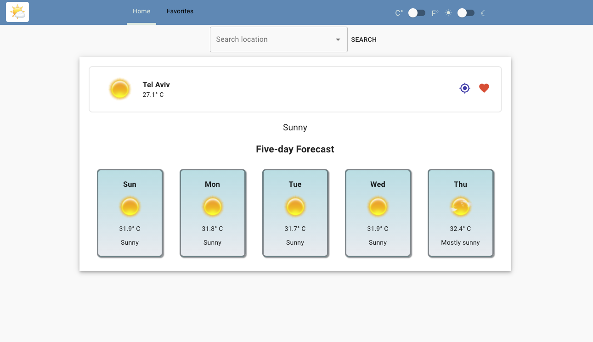
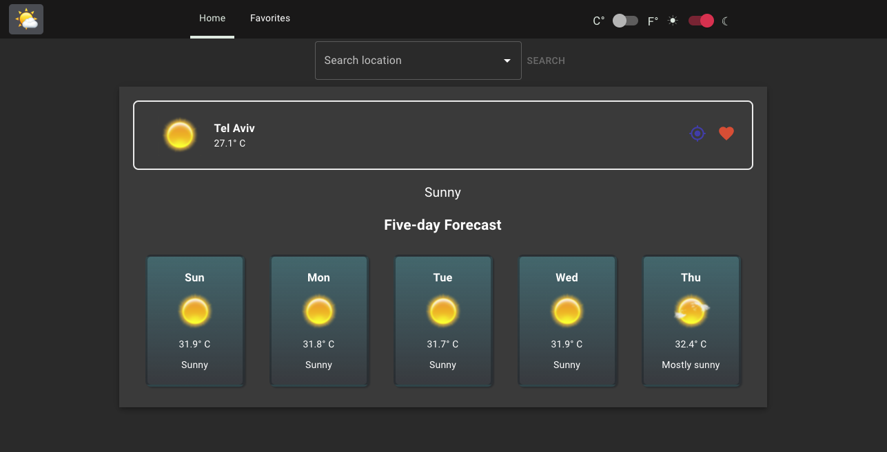
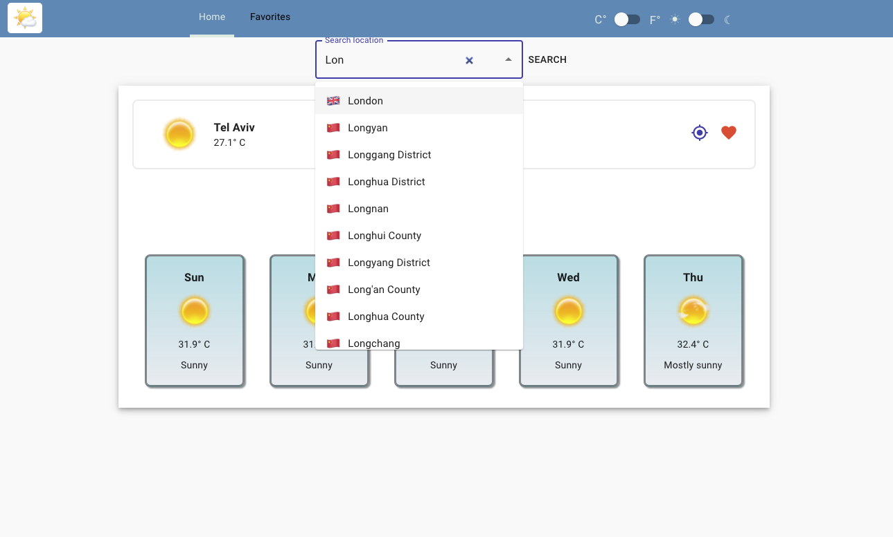
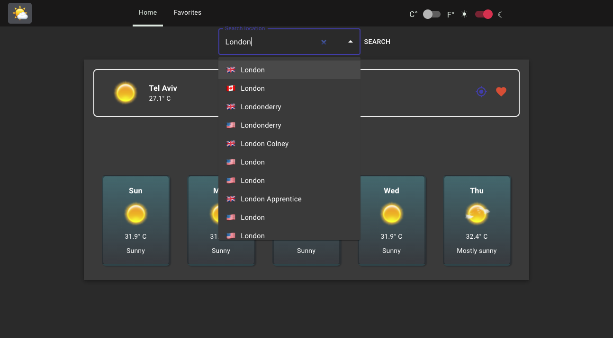
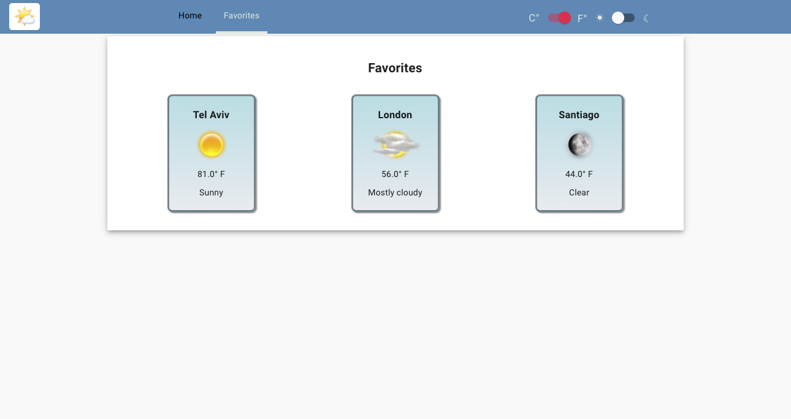
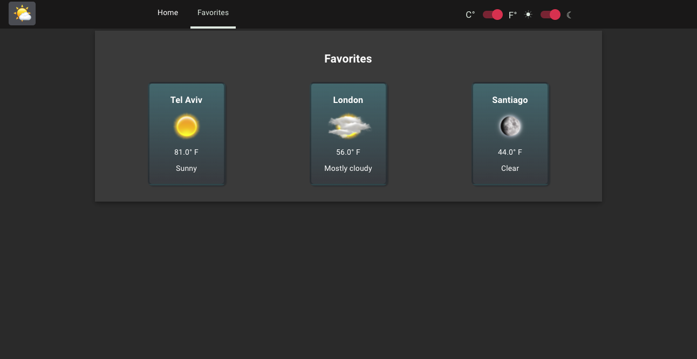

# Weather App

This application is a front-end weather app built with React & TypeScript.

The app provides an updated five-day weather information, either by search or by your current location (if allowed).

You can add your searched locations to favorites and access them via the favorites section.

Supported temperature units are Celsius, and Fahrenheit.

Weather information provided by [AccuWeather](https://www.accuweather.com/)

Demo: [https://rons-weather-app.netlify.app/](https://rons-weather-app.netlify.app/)

## Table Of Contents

- [Weather App](#weather-app)
  - [Table Of Contents](#table-of-contents)
  - [Running the project](#running-the-project)
  - [Screenshots](#screenshots)
    - [Home screen](#home-screen)
    - [Search - Autocomplete](#search---autocomplete)
    - [Favorites Screen](#favorites-screen)
  - [Tech-stack](#tech-stack)

## Running the project

1. Clone the repository and navigate to root directory.
2. Run `yarn install`.
3. Run `cp .env.sample .env` to create a dotenv file.
4. In `./.env`, you will need to set `REACT_APP_API_KEY` with a valid API key from [AccuWeather API](https://developer.accuweather.com/).
5. Run `yarn start`
6. Navigate to `http://localhost:3000`.

## Screenshots

### Home screen

- Search for weather information in a specific location.
- Add the currently displayed location to favorites.
- Use location services to track weather information in your current location.
- toggle between dark or light theme.
- toggle between celsius or fahrenheit.

### Search - Autocomplete

### Favorites Screen

- A grid view of your favorite locations.
- Clicking a location will redirect to a fully detailed weather information of it.

## Tech-stack

1. TypeScript
2. UI - React, Material-UI, styled-components
3. State Management - Redux-Saga
4. HTTP Client - Axios
5. Date formatting - dayjs
6. Animations - Lottie
